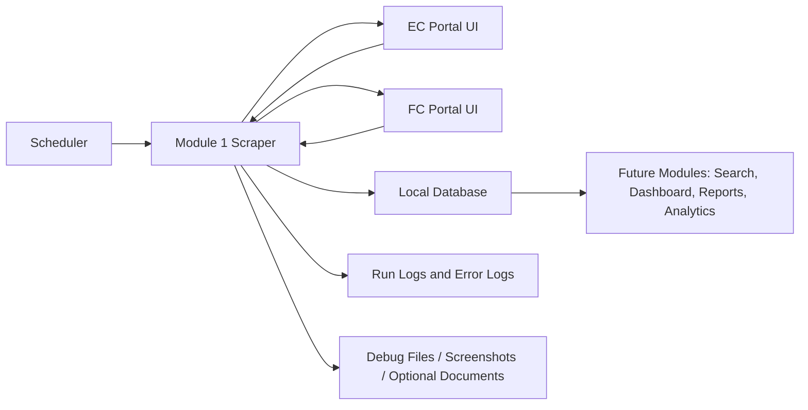
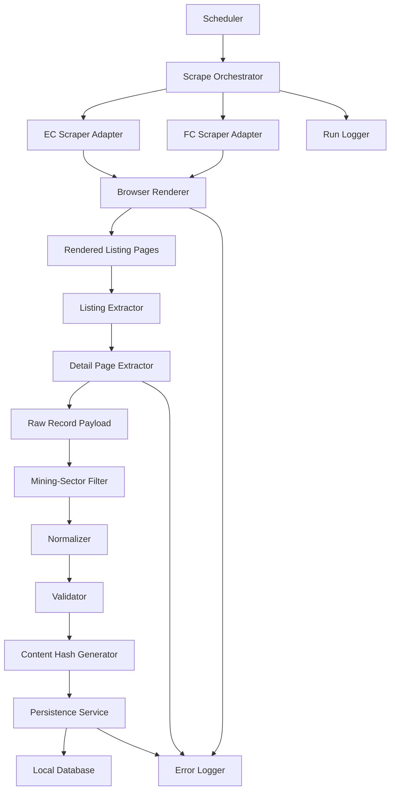
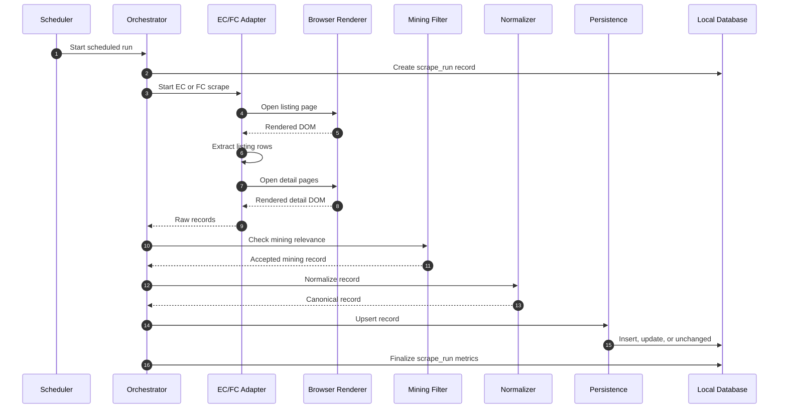
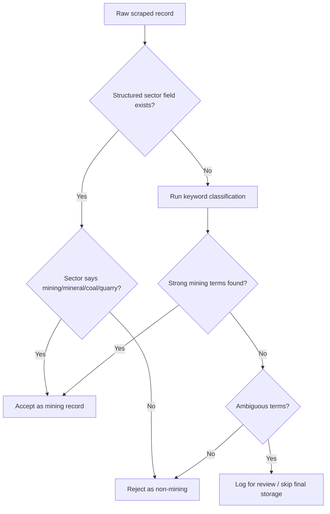
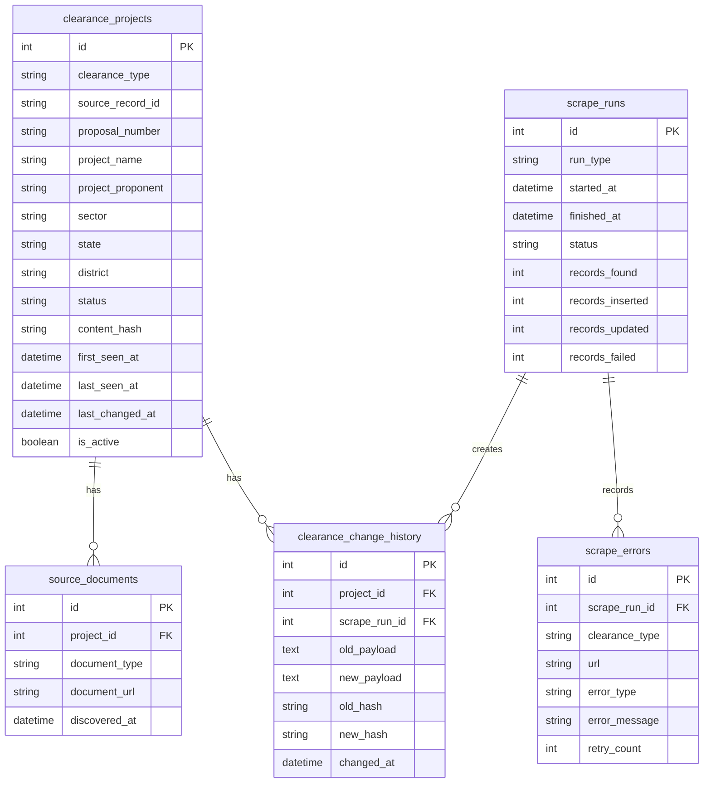
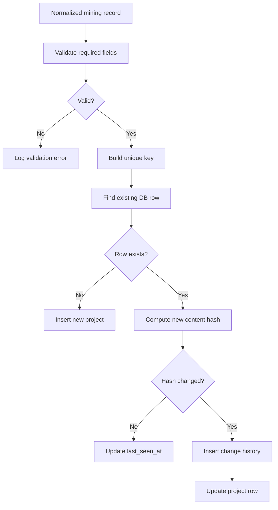
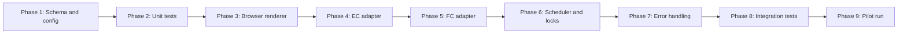

# MACE
Mining Automated Compliance Execution

# Installation process

 1. Install Visual Studio Code
 2. Install Docker Desktop and run it
 3. Install Git
 4. Clone the repository and open in Visual Studio Code
 5. Click on "Open In Container" if no pop-up appears use Ctrl + Shift + P and search "Rebuild dev container clear cache"


# Quick verification checklist

## Python dependency sanity
python3 -m pip check

## Node dependency sanity
npm ls --depth=0

## Port listeners
ss -tulnp | egrep ':(8000|5173|5432)'

## Backend health
curl http://localhost:8000/docs

## Frontend health
curl http://localhost:5173

## Database health
pg_isready -h localhost -p 5432

---

# Module 1: Scheduled EC/FC Mining Clearance Scraper

This README section contains the SDD and TDD for Module 1 only. It is written as GitHub Markdown text so it can be pasted directly into the repository `README.md` or submitted as a pull request without uploading Word `.docx` files.

## Reference Links Used

- [Atlassian - Software Design Document Tips and Best Practices](https://www.atlassian.com/work-management/knowledge-sharing/documentation/software-design-document)
- [Medium - The Ultimate Guide to Writing a Great README.md for Your Project](https://medium.com/@kc_clintone/the-ultimate-guide-to-writing-a-great-readme-md-for-your-project-3d49c2023357)

## Acronyms

| Acronym | Meaning |
|---|---|
| EC | Environmental Clearance |
| FC | Forest Clearance |
| SDD | Software/System Design Document |
| TDD | Technical Design Document |
| UI | User Interface |
| DB | Database |
| DOM | Document Object Model |

## Module Summary

Module 1 is responsible for building a scheduled web scraper that collects Environmental Clearance and Forest Clearance data for mining-sector projects only. The target websites are assumed to be UI-only and JavaScript-rendered, meaning the module cannot depend on a public API. The scraper must open the pages like a browser, wait for the UI content to load, extract listing and detail records, filter the records to mining projects, normalize the extracted fields, and keep a local database updated through repeated scheduled runs.

This module is important because the rest of the application depends on having clean, current, and traceable EC/FC project data. If this ingestion layer is weak, later modules such as analytics, dashboards, reporting, search, or alerts will also become unreliable.

---

# 1. SDD - Software/System Design Document

## 1.1 Purpose

The purpose of Module 1 is to design a reliable local data ingestion system for EC and FC clearance records related to mining-sector projects. Since the source portals do not provide a usable API, the module must use browser automation to interact with JavaScript-rendered pages.

The module must:

- Run automatically on a recurring schedule.
- Scrape EC and FC records from UI pages.
- Extract listing-page and detail-page data.
- Keep only mining-sector records.
- Store normalized records in a local database.
- Detect new, updated, unchanged, failed, and possibly missing records.
- Maintain logs and scrape history for debugging and audit purposes.

## 1.2 Problem Statement

Environmental and forest clearance information is usually published across web portals that are designed for human browsing. These pages may require JavaScript rendering, pagination, filtering, clicking detail pages, or downloading linked documents. Because no direct API is available, manually collecting this data is slow, inconsistent, and difficult to repeat.

Module 1 solves this problem by automating the data collection process while keeping the system safe, traceable, and repeatable.

## 1.3 Goals

- Build a recurring scraper for EC and FC data.
- Support JavaScript-rendered pages using browser automation.
- Extract records consistently from listing and detail pages.
- Filter results so only mining-sector projects are stored.
- Store data in a local database using idempotent upsert logic.
- Preserve raw scraped payloads for traceability.
- Track every scrape run and every error.
- Support future modules by providing clean and normalized data.

## 1.4 Non-Goals

This module will not:

- Submit EC or FC applications.
- Modify any government or public portal data.
- Bypass captchas, authentication, paywalls, or access controls.
- Scrape unrelated sectors for final storage.
- Build a full analytics dashboard.
- Provide real-time streaming updates.
- Replace official records or legal verification.

## 1.5 Assumptions

- EC and FC data is available through public UI pages.
- Source pages are JavaScript-rendered and require browser automation.
- No reliable public API exists for the required data.
- Mining-sector identification can be performed using source fields and fallback keywords.
- A local database is acceptable for the first implementation.
- The scraper will run on a controlled schedule instead of continuously.
- Source portal layouts may change, so selectors must be isolated and testable.

## 1.6 Scope

### In Scope

- Scheduled EC scraping.
- Scheduled FC scraping.
- Browser-rendered page loading.
- Listing-page extraction.
- Detail-page extraction.
- Mining-sector filtering.
- Data normalization.
- Local database persistence.
- Change detection.
- Scrape run logs.
- Error logs.
- Retry handling.
- Screenshot or HTML capture for debugging failures.

### Out of Scope

- Non-mining project storage.
- User interface screens.
- Authentication workflows.
- Captcha solving.
- Cloud deployment automation.
- Legal validation of clearance decisions.

## 1.7 Users and Stakeholders

| Stakeholder | Interest in Module |
|---|---|
| Developers | Need a clear architecture and implementation plan. |
| Data users | Need accurate and current EC/FC records. |
| Project maintainers | Need scheduled ingestion that can be monitored and debugged. |
| Future module owners | Need normalized data for dashboards, reports, search, or analytics. |
| Reviewers/teachers | Need evidence that the module architecture, data flow, and technical plan are understood before coding. |

## 1.8 External Systems

| External System | Role |
|---|---|
| EC source portal | Provides Environmental Clearance records through UI pages. |
| FC source portal | Provides Forest Clearance records through UI pages. |
| Local file system | Stores debug screenshots, optional HTML snapshots, logs, or downloaded documents. |
| Local database | Stores normalized clearance data, scrape runs, errors, and change history. |

## 1.9 High-Level Context Diagram



## 1.10 System Architecture



## 1.11 Component Responsibilities

| Component | Responsibility | Output |
|---|---|---|
| Scheduler | Starts scraping jobs based on configured time intervals. | Run trigger |
| Scrape Orchestrator | Coordinates the full scrape workflow. | Run summary |
| EC Scraper Adapter | Handles EC-specific URLs, filters, selectors, pagination, and extraction. | Raw EC records |
| FC Scraper Adapter | Handles FC-specific URLs, filters, selectors, pagination, and extraction. | Raw FC records |
| Browser Renderer | Loads JavaScript-rendered pages using a browser automation tool. | Rendered DOM, screenshots |
| Listing Extractor | Reads records from tables, cards, or listing views. | Listing records |
| Detail Extractor | Opens detail pages and extracts full record fields. | Raw detail payload |
| Mining Filter | Keeps only mining-sector records. | Accepted or rejected decision |
| Normalizer | Converts inconsistent source fields into the local schema. | Normalized record |
| Validator | Checks required fields and data formats. | Valid record or validation error |
| Hash Generator | Creates stable hashes for change detection. | Content hash |
| Persistence Service | Inserts, updates, or marks records unchanged. | Database result |
| Run Logger | Stores run-level metrics. | Scrape run record |
| Error Logger | Stores failures, retry counts, URLs, and debug paths. | Error record |

## 1.12 Main Data Flow



## 1.13 Mining-Sector Filtering Design

The module must store only mining-sector records. Filtering should happen after extraction but before final database persistence.

### Preferred Filtering

Use source-provided structured fields when available:

- Sector
- Project category
- Proposal type
- Industry type
- Clearance category
- Mineral name
- Mining lease information

### Fallback Keyword Filtering

If structured fields are missing or inconsistent, inspect text fields such as project name, description, proposal summary, and document titles.

Mining indicators include:

- mining
- mine
- mineral
- coal
- iron ore
- bauxite
- limestone
- quarry
- mining lease
- lease area
- extraction
- beneficiation
- manganese
- dolomite
- laterite
- granite
- sand mining

### Rejection Examples

Records should be rejected when they clearly belong to unrelated sectors such as:

- highways
- buildings
- hospitals
- tourism
- irrigation
- non-mining manufacturing
- residential townships
- ports unrelated to mining

### Filtering Decision Flow



## 1.14 Local Database Design

The local database stores both the latest version of each clearance record and the operational history needed to understand how that data was collected.

### Main Entities

| Entity | Purpose |
|---|---|
| `clearance_projects` | Stores the latest known EC/FC data for each mining project. |
| `scrape_runs` | Stores one row for every scheduled, manual, or backfill run. |
| `scrape_errors` | Stores page-level and record-level errors. |
| `clearance_change_history` | Stores old and new payloads when a record changes. |
| `source_documents` | Stores links to clearance letters, PDFs, or supporting documents found during scraping. |

## 1.15 ER Diagram



## 1.16 Data Freshness and Update Rules

The scraper should not blindly replace records every time it runs. It should compare the new normalized data with the existing database record.

| Case | Meaning | Action |
|---|---|---|
| New record | Record does not exist in database. | Insert new row. |
| Existing unchanged record | Record exists and content hash is the same. | Update `last_seen_at` only. |
| Existing changed record | Record exists and content hash is different. | Save change history and update current row. |
| Missing record | Previously seen record is not found in current run. | Do not immediately delete; mark inactive only after repeated missed runs. |
| Failed record | Page or detail extraction failed. | Log error and retry if allowed. |

## 1.17 Scheduling Requirements

| Run Type | Suggested Frequency | Purpose |
|---|---:|---|
| Incremental scrape | Daily | Capture new or recently updated records. |
| Recent reconciliation | Weekly | Recheck recent records for delayed updates. |
| Full reconciliation | Monthly | Detect drift between source portals and local DB. |
| Manual backfill | On demand | Load historical records or recover after scraper changes. |

The scheduler must prevent overlapping runs. If a previous run is still active, the next scheduled run should either be skipped or delayed.

## 1.18 Reliability Requirements

- Retry transient failures with exponential backoff.
- Continue scraping after individual record failures.
- Log every failed URL.
- Capture screenshot or HTML snapshot for selector failures.
- Store raw payloads for later reprocessing.
- Keep selectors isolated so portal UI changes are easier to fix.
- Use conservative stale-record logic to avoid false deletion.

## 1.19 Security and Ethical Requirements

- Do not hardcode credentials, tokens, API keys, or proxy secrets.
- Do not bypass captchas, login pages, or anti-abuse controls.
- Use environment variables for configuration.
- Treat scraped data as untrusted input.
- Validate all extracted fields before writing to the database.
- Use parameterized SQL or ORM-based writes.
- Sanitize scraped text before displaying it in any UI.
- Use polite scraping speeds to avoid overloading source portals.
- Keep logs free of secrets and private credentials.

## 1.20 SDD Acceptance Criteria

The system design is acceptable when:

- EC and FC sources are represented as separate adapters.
- The scraper supports JavaScript-rendered pages.
- The workflow includes listing extraction and detail extraction.
- Mining-sector filtering is clearly defined.
- The database design supports current records, run history, error history, document links, and change history.
- The design includes retry handling and non-overlapping scheduled runs.
- The design explains how duplicates and updates are handled.
- The design includes diagrams showing architecture, flow, and database relationships.

---

# 2. TDD - Technical Design Document

## 2.1 Technical Objective

The technical objective is to implement Module 1 as a maintainable, testable, and scheduled scraper service. The implementation should separate source-specific scraping logic from shared processing logic so EC and FC pages can evolve independently.

## 2.2 Recommended Technology Stack

| Concern | Recommended Tool | Reason |
|---|---|---|
| Language | Python 3.11+ | Good support for scraping, scheduling, data validation, and testing. |
| Browser automation | Playwright | Handles JavaScript-rendered pages, waiting, screenshots, and browser contexts. |
| Scheduler | APScheduler or cron | Simple recurring runs. |
| Database | SQLite for local prototype, PostgreSQL for production | Easy local setup with a clean migration path. |
| ORM | SQLAlchemy | Safer database operations and clearer models. |
| Migrations | Alembic | Version-controlled schema evolution. |
| Testing | pytest | Unit and integration testing. |
| Coverage | pytest-cov | Measures test coverage. |
| Formatting | Black and Ruff | Consistent code style and linting. |

## 2.3 Proposed Folder Structure

```text
module_1_scraper/
  app/
    main.py
    config.py

    scheduler/
      jobs.py
      locks.py

    scrapers/
      base.py
      browser.py
      ec_scraper.py
      fc_scraper.py
      selectors.py

    services/
      mining_filter.py
      normalizer.py
      hashing.py
      persistence.py
      retry.py

    db/
      models.py
      session.py
      migrations/

    logging/
      run_logger.py
      error_logger.py

  tests/
    unit/
      test_mining_filter.py
      test_normalizer.py
      test_hashing.py
      test_persistence.py

    integration/
      test_ec_scraper_fixture.py
      test_fc_scraper_fixture.py
      test_scheduler_lock.py

    fixtures/
      ec_listing.html
      ec_detail.html
      fc_listing.html
      fc_detail.html
```

## 2.4 Runtime Configuration

Configuration must come from environment variables or a `.env` file. Secrets must never be committed.

```text
DATABASE_URL=sqlite:///mace_clearances.db
EC_PORTAL_URL=<to-be-confirmed>
FC_PORTAL_URL=<to-be-confirmed>
SCRAPE_HEADLESS=true
SCRAPE_TIMEOUT_MS=30000
MAX_PAGE_RETRIES=3
SCRAPE_CONCURRENCY=1
MISSED_RUN_STALE_THRESHOLD=3
SCREENSHOT_ON_FAILURE=true
HTML_SNAPSHOT_ON_FAILURE=true
```

## 2.5 Core Classes

### `ScrapeOrchestrator`

Coordinates the full scrape run.

Responsibilities:

- Create a scrape run record.
- Start EC and FC adapters.
- Send raw records to the mining filter.
- Normalize accepted records.
- Persist records.
- Track inserted, updated, unchanged, skipped, and failed counts.
- Finalize run status.

### `BaseScraper`

Defines the common scraper interface.

```python
class BaseScraper:
    clearance_type: str

    def scrape(self) -> list[dict]:
        ...

    def fetch_listing_pages(self) -> list[dict]:
        ...

    def fetch_detail(self, listing_record: dict) -> dict:
        ...
```

### `ECScraper`

Handles EC-specific behavior:

- EC listing URL.
- EC filters.
- EC table selectors.
- EC detail page selectors.
- EC field mapping.

### `FCScraper`

Handles FC-specific behavior:

- FC listing URL.
- FC filters.
- FC table selectors.
- FC detail page selectors.
- FC field mapping.

### `BrowserRenderer`

Responsible for browser automation.

```python
class BrowserRenderer:
    def open_page(self, url: str):
        ...

    def wait_for_selector(self, selector: str):
        ...

    def get_text(self, selector: str) -> str:
        ...

    def get_html(self) -> str:
        ...

    def screenshot_on_error(self, path: str):
        ...
```

### `MiningFilter`

Returns a structured decision.

```python
{
  "accepted": true,
  "reason": "sector field matched Mining",
  "matched_terms": ["Mining"]
}
```

### `Normalizer`

Converts raw source values into a stable canonical record.

Responsibilities:

- Trim whitespace.
- Normalize dates.
- Normalize status values.
- Normalize document URLs.
- Standardize empty values to `null`.
- Preserve original raw payload.

### `PersistenceService`

Handles database writes.

```python
def upsert_clearance_project(record: dict, scrape_run_id: int) -> str:
    ...
```

Return values:

- `inserted`
- `updated`
- `unchanged`
- `failed`

## 2.6 Normalized Record Shape

```json
{
  "clearance_type": "EC",
  "source_record_id": "source-specific-id",
  "proposal_number": "IA/XX/MIN/000000/2026",
  "project_name": "Mining Project Name",
  "project_proponent": "Company or Agency",
  "sector": "Mining",
  "sub_sector": "Coal / Non-coal / Mineral Type",
  "state": "State",
  "district": "District",
  "mineral": "Iron Ore",
  "mine_area": "100 ha",
  "capacity": "1.0 MTPA",
  "status": "Granted",
  "stage": "EC Granted",
  "clearance_date": "YYYY-MM-DD",
  "validity_date": "YYYY-MM-DD",
  "source_url": "https://source-detail-page",
  "document_urls": [
    "https://source-document-url"
  ],
  "raw_payload": {
    "source_label": "source value"
  }
}
```

## 2.7 Database Schema Draft

### `clearance_projects`

```sql
CREATE TABLE clearance_projects (
    id INTEGER PRIMARY KEY AUTOINCREMENT,
    clearance_type TEXT NOT NULL,
    source_record_id TEXT,
    proposal_number TEXT,
    project_name TEXT NOT NULL,
    project_proponent TEXT,
    sector TEXT,
    sub_sector TEXT,
    state TEXT,
    district TEXT,
    mineral TEXT,
    mine_area TEXT,
    capacity TEXT,
    status TEXT,
    stage TEXT,
    clearance_date DATE,
    validity_date DATE,
    source_url TEXT,
    document_urls TEXT,
    raw_payload TEXT NOT NULL,
    content_hash TEXT NOT NULL,
    first_seen_at DATETIME NOT NULL,
    last_seen_at DATETIME NOT NULL,
    last_changed_at DATETIME,
    is_active BOOLEAN NOT NULL DEFAULT 1,
    UNIQUE(clearance_type, source_record_id)
);
```

### `scrape_runs`

```sql
CREATE TABLE scrape_runs (
    id INTEGER PRIMARY KEY AUTOINCREMENT,
    run_type TEXT NOT NULL,
    started_at DATETIME NOT NULL,
    finished_at DATETIME,
    status TEXT NOT NULL,
    records_found INTEGER DEFAULT 0,
    records_accepted INTEGER DEFAULT 0,
    records_inserted INTEGER DEFAULT 0,
    records_updated INTEGER DEFAULT 0,
    records_unchanged INTEGER DEFAULT 0,
    records_failed INTEGER DEFAULT 0
);
```

### `scrape_errors`

```sql
CREATE TABLE scrape_errors (
    id INTEGER PRIMARY KEY AUTOINCREMENT,
    scrape_run_id INTEGER NOT NULL,
    clearance_type TEXT,
    url TEXT,
    source_record_id TEXT,
    error_type TEXT,
    error_message TEXT,
    retry_count INTEGER DEFAULT 0,
    screenshot_path TEXT,
    html_snapshot_path TEXT,
    created_at DATETIME NOT NULL
);
```

### `clearance_change_history`

```sql
CREATE TABLE clearance_change_history (
    id INTEGER PRIMARY KEY AUTOINCREMENT,
    project_id INTEGER NOT NULL,
    scrape_run_id INTEGER NOT NULL,
    old_payload TEXT NOT NULL,
    new_payload TEXT NOT NULL,
    old_hash TEXT NOT NULL,
    new_hash TEXT NOT NULL,
    changed_at DATETIME NOT NULL
);
```

### `source_documents`

```sql
CREATE TABLE source_documents (
    id INTEGER PRIMARY KEY AUTOINCREMENT,
    project_id INTEGER NOT NULL,
    document_type TEXT,
    document_url TEXT NOT NULL,
    file_name TEXT,
    discovered_at DATETIME NOT NULL,
    UNIQUE(project_id, document_url)
);
```

## 2.8 Upsert Algorithm



Detailed steps:

1. Validate required fields.
2. Build unique key using `clearance_type + source_record_id`.
3. If `source_record_id` is missing, fall back to `clearance_type + proposal_number`.
4. Normalize all business fields.
5. Compute content hash.
6. Insert new record when no matching row exists.
7. Update only `last_seen_at` when the hash is unchanged.
8. Write change history and update the main row when the hash changes.
9. Log validation failures without stopping the whole run.

## 2.9 Content Hash Rules

Include fields that represent meaningful source changes:

- `project_name`
- `project_proponent`
- `sector`
- `sub_sector`
- `state`
- `district`
- `mineral`
- `mine_area`
- `capacity`
- `status`
- `stage`
- `clearance_date`
- `validity_date`
- sorted `document_urls`

Exclude operational fields:

- `first_seen_at`
- `last_seen_at`
- `last_changed_at`
- `scrape_run_id`
- retry count
- screenshot path
- temporary page metadata

## 2.10 Error Handling Strategy

| Error Type | Example | Handling |
|---|---|---|
| Navigation timeout | Page does not load in time. | Retry with exponential backoff. |
| Selector missing | Expected table selector is not found. | Capture screenshot and HTML snapshot. |
| Pagination failure | Next button not clickable. | Log page failure and continue if possible. |
| Detail extraction failure | Detail page layout changed. | Log record-level error and continue. |
| Validation failure | Missing project name or identifier. | Reject record and log reason. |
| Database failure | Insert or update fails. | Roll back transaction and mark run failed if needed. |
| Source unavailable | Portal is down. | Abort adapter and preserve run summary. |

## 2.11 Test Plan

### Unit Tests

| Test File | What It Verifies |
|---|---|
| `test_mining_filter.py` | Mining keyword detection, structured sector matching, rejection of non-mining sectors. |
| `test_normalizer.py` | Date parsing, whitespace cleanup, status normalization, URL normalization. |
| `test_hashing.py` | Stable hash generation and exclusion of operational fields. |
| `test_persistence.py` | Insert, update, unchanged, and change-history behavior. |

### Integration Tests

| Test File | What It Verifies |
|---|---|
| `test_ec_scraper_fixture.py` | EC listing and detail fixture extraction. |
| `test_fc_scraper_fixture.py` | FC listing and detail fixture extraction. |
| `test_scheduler_lock.py` | Prevents overlapping scheduled runs. |
| `test_database_flow.py` | End-to-end persistence using a temporary database. |

### Browser Smoke Test

The browser smoke test should:

1. Open a saved JS-rendered fixture page.
2. Wait for the listing table or record container.
3. Extract listing rows.
4. Open a detail fixture.
5. Extract raw fields.
6. Filter to mining-sector records.
7. Normalize the accepted record.
8. Persist it.
9. Verify the database row exists.

## 2.12 Dev Container Environment Check

If the repository uses a VS Code dev container, open the repository in VS Code and run:

```text
Dev Containers: Reopen in Container
```

After the container starts, verify:

```bash
python --version
pip --version
pytest --version
playwright --version
```

Install Playwright browsers if needed:

```bash
python -m playwright install
```

Run tests:

```bash
pytest
```

Run coverage:

```bash
pytest --cov=app --cov-report=term-missing
```

Expected coverage target:

```text
80% or higher
```

## 2.13 Implementation Phases



### Phase Details

1. Create project structure, settings, database models, and migrations.
2. Write unit tests for filtering, normalization, hashing, and persistence.
3. Implement browser rendering and fixture-based extraction.
4. Implement EC source adapter.
5. Implement FC source adapter.
6. Add scheduler jobs and non-overlap locking.
7. Add retry handling, screenshots, and scrape error logging.
8. Run integration and browser smoke tests.
9. Pilot the scraper with conservative concurrency and inspect logs.

## 2.14 TDD Acceptance Criteria

The technical design is complete when:

- EC and FC adapters are separated.
- JavaScript-rendered pages can be loaded through Playwright.
- Listing and detail extraction are both supported.
- Mining-sector filtering has structured and keyword-based paths.
- Data normalization produces a stable canonical record.
- Database upsert behavior prevents duplicates.
- Changed records create change-history rows.
- Failed pages are logged and retried.
- Scheduled runs do not overlap.
- Unit and integration tests can reach at least 80 percent coverage.

---

# 3. Open Items Before Implementation

These items should be confirmed before coding:

- Exact EC portal URL.
- Exact FC portal URL.
- Final database choice: SQLite or PostgreSQL.
- Required production schedule.
- Whether source documents should only be linked or also downloaded.
- Deployment target: local machine, dev container, server, Docker, or cloud job.
- Naming convention for this module inside the shared repository.

---

# 4. Pull Request Notes

This README content is intentionally module-specific. It avoids repeating shared repository-level information such as overall project name, team members, or global setup instructions, because those sections may be handled by other team members in separate pull requests.

Suggested commit message:

```bash
docs: add module 1 SDD and TDD
```
